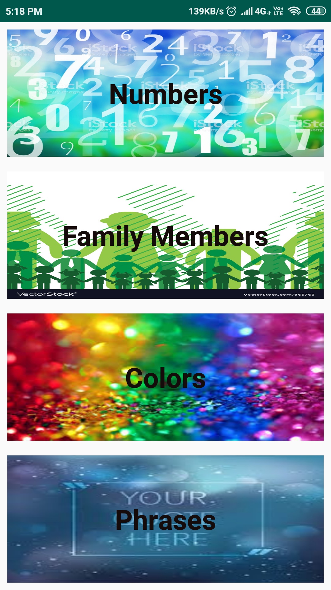
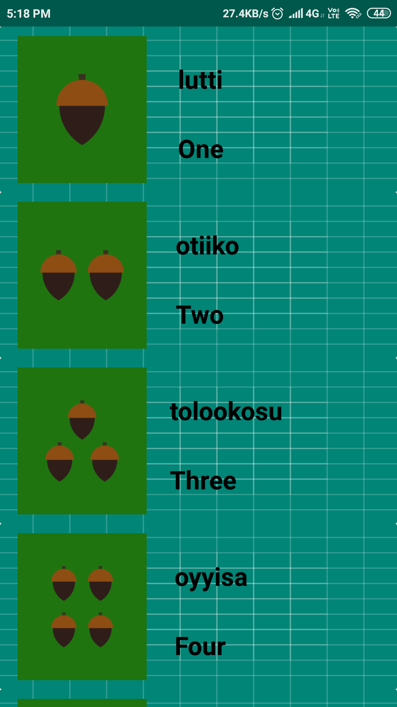
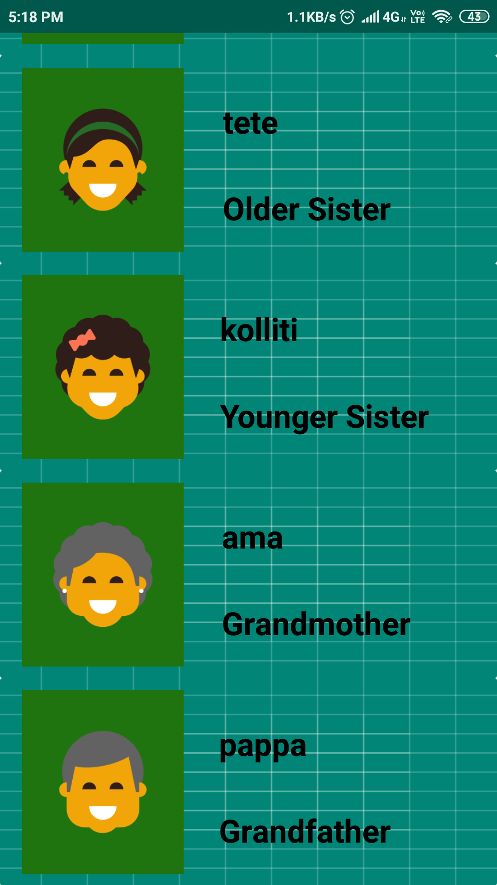
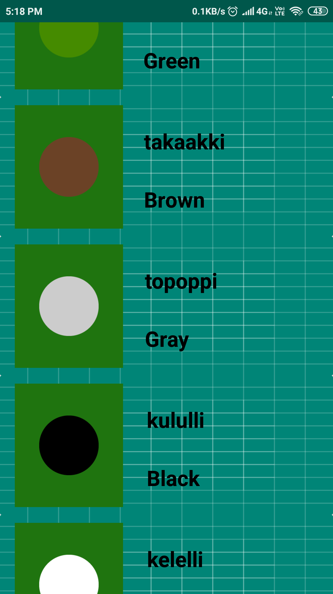

# Mivok
This is a MultiScreen app that has 4 other activities other than the main activity.
This app gives translation of words in a regional language named mivok.
It has 4 activities Numbers,Family,Colors,Phrases.
It has most frequently used words in order of the above mentioned activities.
Other than translation it also pronouces the words if we click on any item.

<pre>                             </pre>

<pre>                             </pre>

Below is a link to see the app live in action: 
 
